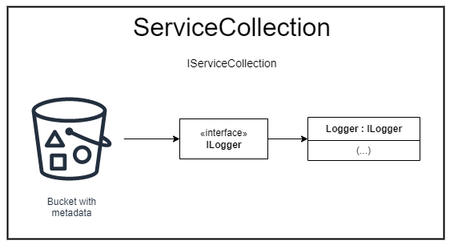
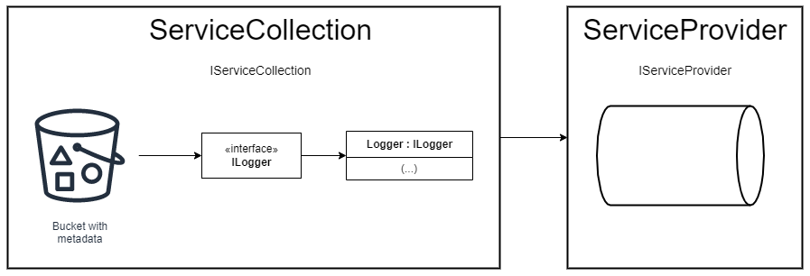

# Dependency injection in dotnet core & dotnet 5/6 <!-- omit in toc -->

## Contents <!-- omit in toc -->

- [1. Why dependency injection?](#1-why-dependency-injection)
  - [1.1. Highly coupled](#11-highly-coupled)
  - [1.2. Reducing coupling](#12-reducing-coupling)
  - [1.3. Benefits of dependency injection](#13-benefits-of-dependency-injection)
- [2. ServiceCollection and ServiceProviders class](#2-servicecollection-and-serviceproviders-class)
  - [2.1. ServiceCollection](#21-servicecollection)
  - [2.2. ServiceProvider](#22-serviceprovider)
  - [2.3. Resume of responsabilities](#23-resume-of-responsabilities)
- [3. Three mehtods of inejction in ServiceCollection](#3-three-mehtods-of-inejction-in-servicecollection)
  - [3.1. AddSingleton](#31-addsingleton)
  - [3.2. AddScoped](#32-addscoped)
  - [3.3. AddTransient](#33-addtransient)
- [4. Points of attention...](#4-points-of-attention)

## 1. Why dependency injection?

### 1.1. Highly coupled

- The dependency injection mainly comes from an object oriented design principle, concrete classes must not be dependent on each other, this is called low coupling.
- Then we say that they are highly coupled and opposite when they are not depending on each other.

[Example with highly coupled](ExampleObjectCompositionWithoutInterface)

- The problem is that imagine that this `DataAccess` class rights, the data to SQL Server, and you have, for example, 10 lines of code that divides the data to SQL Server. If we want to switch from SQL Server to, for example, MySql or to a NoSql database, either you have to come and change the body of your method, which this is against the open `closed principle`, because what if we want to go back to SQL Server at some point, you have to again come back and put your old code back in here, or how about the tests that you might have lacunae test and integration test.
- You break all your tests so your `Business` class now has dependency on your `DataAccess` class, because if I change the data access, I'm going to break the `Business` class.
- Your new `DataAccess` necessarily won't have the same method store or even if they have the same methods, then the signature might be different.
- Likewise, your `UserInterface` class has dependency on your `Business` class.
- Again, if you want to change the way we validate data, we will have to change the body of the business class and that can again break a lot of parts of your application.

### 1.2. Reducing coupling

- To reduce this type of coupling or dependency, what we can do is that your user interface can work with an `interfaces`.
- So instead of working directly with the `Business` class, which is the concrete class, it can work with an interface because the interface has the method and has the parameters for the method.
- Your `UserInterface` can use the interface.
- It can only talk to the interface because what your `UserInterface` needs is that what methods exist in the `Business` class and what is the signature of that method.
- Likewise, your `DataAccess` doesn't have to be there as long as there is an interface that has the methods and method signatures and possibly the properties that the business class needs in order to talk to the `DataAccess` layer or `DataAccess` class, the `Business` class will be fine so we can replace the `Business` class with an interface that demonstrates the methods, properties and method signatures of the `Business` class.
- Likewise, we can replace the `DataAccess` class with an interface that represents the methods, properties and method signatures of the data access class. So `UserInterface` will work with the `IBusiness` classes interface and `Business` class will work with the `IDataAccess` interface.
- And now every time we want to actually do something in the `Business` class, dependency injection comes into play and creates an instance of the `Business` class and then makes a call to the actual methods inside the `Business` class.
- Likewise, whenever we need an actual `DataAccess`, then dependency injection creates an instance of your `DataAccess` class, which implements the `IDataAccess` interface or `DataAccess` class, and performs the actual writing or storing data in your database.

[Example reducing coupling with interfaces](ExampleObjectCompositionWithInterface)

### 1.3. Benefits of dependency injection

- Clean code
  - Your code is easier to understand
    - So when you use dependency injection, your code will be a lot cleaner and easier to understand, because, for example, if I only use a `Business` class or `IBusiness` interface and not the actual concrete classes, all you need to know is that what is the signature, what are the methods and what are the properties.
- Better reusability
  - Low coupling allows modules to be reused
    - You don't need to know the details of how things work in a `Business` class. So it will be easier to understand a given code and then the modules and classes will be more usable because you know the interfaces of the classes. If the classes implement a given interface, then you can easily reuse them anywhere that interface is known.
- Better unit testing
  - Concrete class can be replace by mocks
    - And also dependency, injection and interfaces make unit testing very easy. In fact, interfaces and dependency injection is crucial for writing good unit tests because in unit tests you only test one module and all the other dependencies should be just fake or mock's, which mean that they shouldn't actually do anything.
- Low coupling
  - Concrete classes can be replaced
    - You can easily replace concrete classes because if you use the interface, you don't really need to know how actual concrete classes work and that will help you with low coupling.

## 2. ServiceCollection and ServiceProviders class

### 2.1. ServiceCollection



- In independence injection, there is a `bucket` or `container` which we put all the `metadata` inside it.
- For example, imagine that in the `bucket`, your metadata is that `ILooger` has to be translated to a class called `Logger` because independents injection, we rely on interfaces in order to reduce the coupling and reduce the dependency instead of putting classes and objects in the `metadata` `bucket`.
- We normally say every time you see an interface called `ILogger`, what I want is an object of type default `Logger`.
- So we put all the `metadata` in a `bucket` and that `bucket`, which is our dependency injection container, is represented in `dotnet core` with a class called `ServiceCollection`.
  - So a `ServiceCollection`, which implements an interface called `IServiceCollection`, that is your dependency injection container and it includes your `metadata`.
  - It doesn't include your actual data.
  - It's only `metadata` that sits in the `bucket` and your `metadata` begins with your interface.
  - **A `ServiceCollection` is only responsible for including and containing the `metadata`.**
    - **It doesn't create the actual C# or dotnet core objects.**

### 2.2. ServiceProvider

- `ServiceProvider` which implements an interface called `IServiceProvider` is responsible to create instances of objects and pass them to you.
- The `ServiceCollection` in order to put our metadata in it, and then `ServiceCollection` will give us an instance of `ServiceProvider` and then we always ask `ServiceProvider` to give us the objects that we need.



### 2.3. Resume of responsabilities
- ServiceCollection
  - So the responsibility of `ServiceCollection` is holding the metadata and mapping of types.
- ServiceProvider
  - The responsibility of `ServiceProvider` is creating instances and managing the lifetime of the instances.

creating instances and managing the lifetime of the instances.

## 3. Three mehtods of inejction in ServiceCollection

### 3.1. AddSingleton

- Same instance for the entire application

### 3.2. AddScoped

- Same instance for the whole request

### 3.3. AddTransient

- Different instance every time object is requested or injected

## 4. Points of attention...

- In this scenario whats the best options?

```
public class ClassWithStaticProperty
{
    public static List<int> PrimaryKeys;

    public void Save()
    {

    }
}
```

- AddScoped or AddTransient?
  - And there is and is that the `PrimaryKeys` property is a static static properties are not dependent on the instance.
  - There is only one instance of this property and that is across the whole application because it is a static.
  - So no matter whether you use AddTransient or AddScoped, you will always have only one object `PrimaryKeys`.
